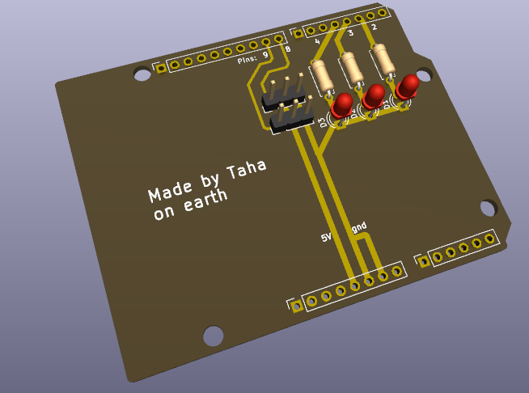
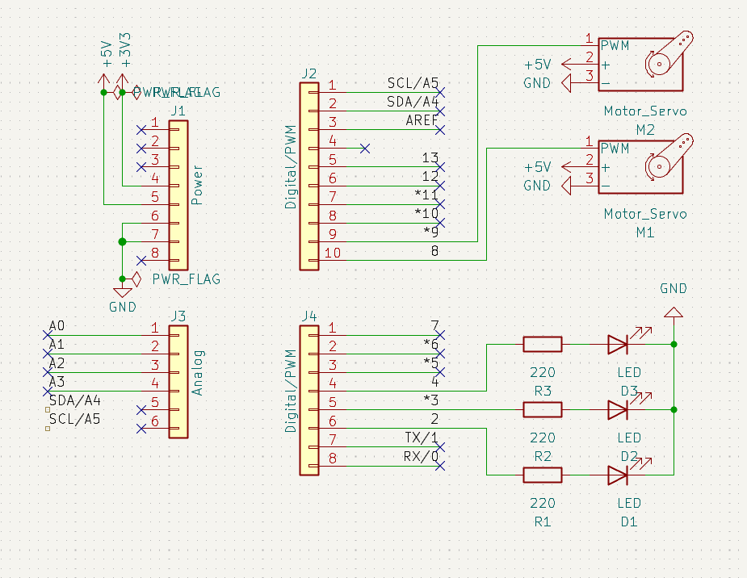

# EchoGuard

EchoGuard is a security system that is meant to be more efficient than conventional cameras. The main part is a camera turret which is ceiling mounted and uses microphones in order to detect suspicious activity and lock on to it. It also uses a wall mounted ultrasonic sensor to detect anyone who walks past a certain line using bluetooth to transmit the data.  
Demo video: 

## What is included

This project includes the Cad files for the ultrasonic wall sensor and the turret demo as it is not ceiling mounted, along with the 3mf files in order to print them.
It also includes the codes to use the turret "main_v2.py" is the stable version which tracks the person's face using mediapipe, calculates the bearing of when the face was last seen and the offset from the center (dy and dx) and sends it to the arduino through serial communication. "main_v3" is an experimental version which does not work properly, where I tried to implement ROI in order to increase the speed at which mediapipe analyzed the images by reducing the load. The codes to upload to the microcontrollers are also included.
Before 3d printing the whole thing, I included 3mf files in order to test the snap fit of the ultrasonic sensor "snap_fit_test", along with "bearing_test" as the size of the bearings varies and the project uses bearings for the rotating base.
It also includes a simple pcb that would replace the breadboard and messy jumper wires  

## How to recreate the project

The circuits are quite simple but here are schematics nontheless  

1. Use Arduino IDE in order to upload the code "EchoGaurd" for the arduino and note down the COM port used.

2. Use your code editor to update the port number in line the 8th line 
arduino = serial.Serial("COM3", 115200) change the number 3 with your port. 

3. Install the libraries mediapipe, opencv, pyserial, and numpy by running these comands in the terminal
```sh
pip install opencv-python
pip install mediapipe
pip install pyserial
pip install numpy
```

4. After 3d printing the parts, put the bearings in their holder, the bearing should have a diameter greater than the holder however try and make at least hald the bearing inside the holder.

5. Snap fit the servo at the base and either change the CAD file to fit your servo or use hot glue to connect it to the top part.

6. snap fit the tilt servo onto the top part and hot glue the camera holder and tape the camera (or adjust for a tight fit)

7. Ensure the servos are well oriented 

8. With the arduino IDE closed run the python script "main_v2" 
The demo should be up and running tracking your face, looking for it when out of frame, and returning to idle mode if it doesn't find you!

9. Hot glue a lazer if you want to see how dead accurate it is but be careful with your eyes!

10. In order to use the sensor simply snap fit the switch an solder the connections to your esp32, and close the box.

11. If you want the turret to look at the sensor when triggered use the "EchoGuard_sensor" version on your arduino and the python script "main_v2_sens"
In case of a "Port is busy" error simply close the python script
Also using the library manager install the following libraries:
Ultrasonic by Erick Simões
BluetoothSerial by Henry Abrahamsen

12. Update the sens_X and sens_Y angles to match the position of your sensor 


## Use pf AI
AI wasn't used in any major part of the project, ChatGpt was used to brainstorm and minor debugging in the python scripts. The CAD and PCB design along with the electronics and firmware were totally AI free.


## Tech Stack

### Software
- Python
- OpenCV
- MediaPipe
- Arduino IDE (C++)
- KiCad 
- Fusion 360
### Hardware
- Arduino Uno R4
- ESP32
- HC-SR04 Ultrasonic Sensor
- USB Webcam
- 2 pcs Servo Motors


## How it was made
The project started by designing the turret, the main issue was how I could make a rotating base that would be controlled with a servo. The issue was solved by using bearings. After testing the bearing holders I printed the base and the top parts.
The wiring was made using a breadboard before designing a pcb due to the connections breaking as the turret would rotate.
The software was then developed in Python using OpenCV and MediaPipe to detect the face offset from the center of the camera (dx and dy) along with the calculation of the bearing of when the face was last seen. Using trigonometry was necessery otherwise the camera would drift linearly to a corner.
A v3 version was made to optimize the code using ROI however it wasnt successful and I kept it for others to further improve it. 

